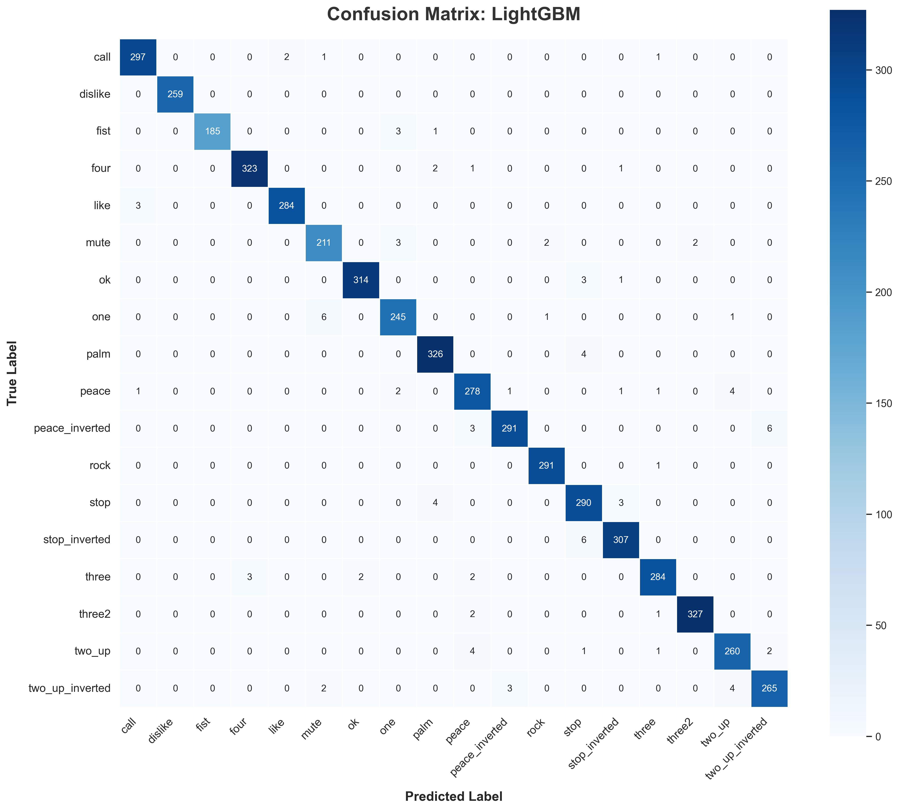

<h1 align="center">✋ Hand Gesture Classification (HaGRID)</h1>

<p align="center">
  <b>Supervised Machine Learning Project</b><br>
  Information Technology Institute (ITI)
</p>

---

<p align="center">
  
  
  
  
</p>

---

## 👨‍💻 Author Information

- **Name:** Ahmed Gamal Ahmed  
- **Track:** AI – Intake 46 – Alexandria Branch  
- **Subject:** Supervised Machine Learning Final Project
- **Project Title:** Hand Gesture Classification using LightGBM and MediaPipe 

---

## 📖 Project Overview
This project presents an end-to-end framework for dynamically classifying human hand gestures using advanced machine learning architectures. By extracting spatial hand landmarks (x, y, z coordinates) from the extensive **HaGRID dataset** via **Google MediaPipe**, we eliminate heavy raw-image processing overheads. 

Instead of deploying immense, slow Convolutional Neural Networks (CNNs), this project proves that providing highly engineered skeletal coordinate data to rapid, gradient-boosted decision trees (like **LightGBM** and **XGBoost**) can achieve an incredible **98.43% F1-Macro score** across 18 distinct gestures with near-instant inference latency.

This repository features 2 branches:
* **`main`**: The current branch, The core classification code and logic.
* **`research`**: This branch is featuring hyper-detailed, multi-phase **MLflow Tracking** to mathematically optimize hyperparameter scaling.

---

---

## 🛠️ Usage & Instructions

### 1. Training the Pipeline
If you wish to train your own models from scratch:

1. Clone the repository and install the dependencies:
   ```bash
   pip install -r requirements.txt
   ```
2. Open `main.ipynb` in Jupyter Notebook/Lab and run the cells sequentially. 

> [!WARNING]
> **Training Time considerations:** The `RandomForestSearchCV` and `GridSearchCV` blocks in the *Qualifications* and *Fine-Tuning* phases perform hundreds of Cross-Validation fits and may take hours depending on your CPU. 
> 
> *Recommendation:* Since the optimal hyperparameters have already been discovered and documented above, you may safely skip navigating the Phase 1 and 2 grids and plug the final parameters directly into the **Last Model Standing** phase!

### 2. Testing & Live Inference
To test the pre-trained champion sequence directly on a video feed using the `inference_only` script:

1. Place your target `.mp4` video inside the `videos/` folder.
2. Ensure you have the serialized LabelEncoder and Model from the `models/` directory.
3. Run the inference script.

> [!TIP]
> **For maximum model accuracy:** We highly recommend using `cv2` (OpenCV) to capture the video streams or interact with your webcam, and strictly maintaining the default resolution format of `640x480`. Standardizing the frame dimensions ensures the spatial coordinates the model trained on directly align with the inference stream!

<br>

---

### 🚀 Pipeline Phases

We manage the lifecycle of our models across three distinct deployment phases:

#### 1. `🔍 Phase: Qualifications`
* Broad randomized hyperparameter searches (`RandomizedSearchCV`) across our baseline models: `LightGBM`, `XGBoost`, `RandomForest`, and `LogisticRegression`.
* **Architecture:** **Parent** *(Algorithm Summary)* ➔ **Children** *(Parameter Variations)*

#### 2. `🎯 Phase: Fine-Tuning`
* High-resolution parameter sweeps (`GridSearchCV`) targeting the top 3 high-potential models identified during Qualifications. 
* **Architecture:** **Parent** *(Detailed Best Model)* ➔ **Children** *(Precise Parameter Variations)*

#### 3. `🏆 Phase: Final`
* The single undisputed champion model, evaluated on strictly held-out `X_test` data.
* Tracks ultimate `f1_macro` metrics, combined with serialized artifacts (`.pkl`), the `Confusion Matrix`, and `ROC Curves`.
* **Architecture:** Standalone run.

<br>

## 📊 Pipeline Results & Model Comparison 

By tracking each phase meticulously, we captured the progression of our classifiers from baseline combinations to highly optimized champion architectures. The comparison below illustrates this journey.

### 1. Qualifications Phase (Randomized Baseline)
We initially evaluated four distinct algorithm concepts using 3-fold Stratified Cross-Validation to quickly establish performance ceilings.

| Model Algorithm | Type | Best CV F1-Macro | 
| :--- | :--- | :---: |
| **LightGBM** | Light Gradient Boosting Tree | **0.9794** | 
| **XGBoost** | Extreme Gradient Boosting Tree | **0.9759** | 
| **RandomForest** | Ensembled Bagging Tree | 0.9652 | 
| **LogisticRegression**| Linear Baseline | 0.9481 | 

*The tree-based boosted learners generalized best over the high-dimensional landmark coordinates. LightGBM and XGBoost were formally selected to advance.*

<br>

### 2. Fine-Tuning Phase (Exhaustive Grid Search)
Our top two models were subjected to rigorous hyperparameter tuning to mathematically optimize components like tree depth, learning rate, and estimators. Both models pushed beyond their initial baselines.

| Model | Pre-Tuning F1 | Post-Tuning F1 | Absolute Gain |
| :--- | :---: | :---: | :---: |
| **LightGBM** | 0.9794 | **0.9802** | + 0.0008 |
| **XGBoost** | 0.9759 | **0.9792** | + 0.0033 |

#### 🔑 The Winning Hyperparameter Architectures
* **LightGBM:** `n_estimators`: 400 \| `learning_rate`: 0.1 \| `num_leaves`: 31 \| `subsample`: 0.8 \| `min_child_samples`: 20
* **XGBoost:** `n_estimators`: 400 \| `learning_rate`: 0.1 \| `max_depth`: 7 \| `subsample`: 0.8 \| `reg_lambda`: 5.0

<br>

**Visualizing the Fine-Tuned Validation Patterns:**
<p align="center">
  
  
</p>
<p align="center"><em>LightGBM's remarkable internal structure processing the Validation splits after Tuning.</em></p>

<br>

### 3. Last Model Standing (Target Set Benchmark)
We pitted the two structurally finalized models against the pure, purely untouched `X_test` dataset to guarantee no variance leaked during cross-validation, allowing us to crown the ultimate algorithm.

| Rank | Model | Final Test F1-Macro | 
| :---: | :--- | :---: |
| 🥇 | **LightGBM (Tuned)** | **0.9843** |
| 🥈 | **XGBoost (Tuned)** | 0.9814 |

#### 🏆 Ultimate Champion: LightGBM
By securing an astounding **98.43% F1-Macro** over 18 disparate gesture classes using pure semantic landmarks, LightGBM is undeniably the most efficient and robust classification model. Its sheer lightweight nature theoretically minimizes API latency in production over XGBoost, too.

<p align="center">
  
  
</p>

<br>


## 📄 License

This project is open-source and available under the standard **MIT License**. 

Feel absolutely free to fork, explore, submit Pull Requests, or heavily modify the spatial modeling architecture for your own gesture recognition environments! Contributions are always welcome.
